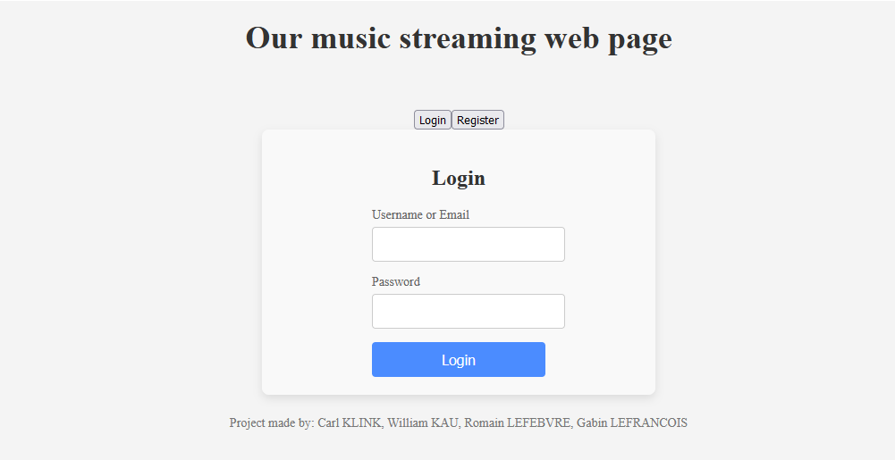
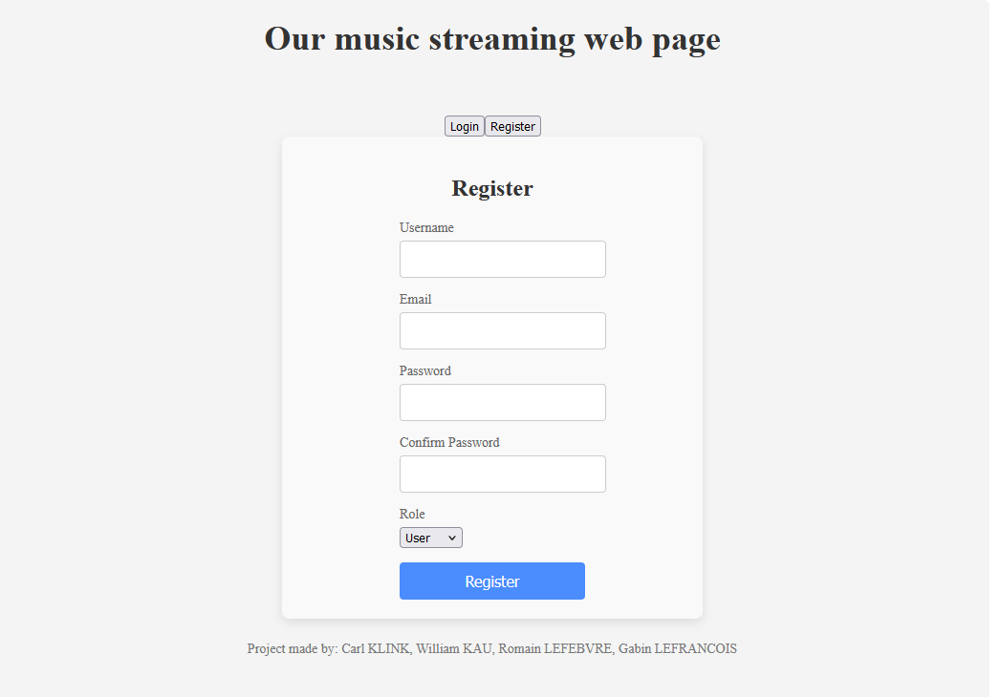
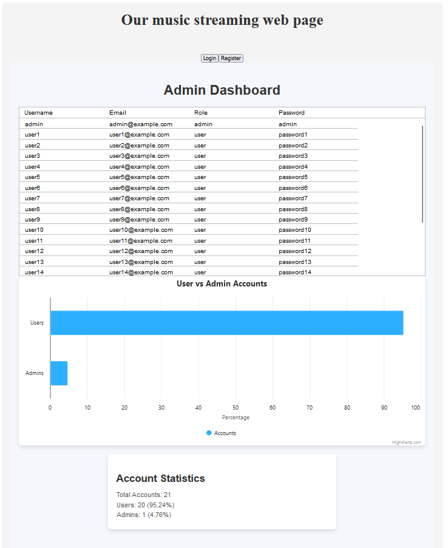
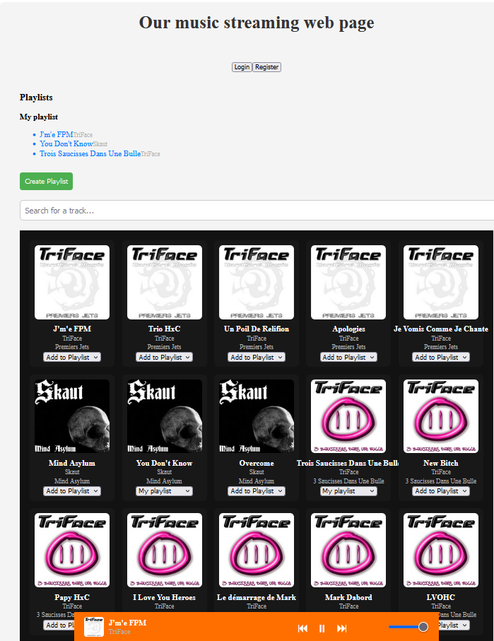

Project Node&React at ESILV.

Team : William KAU, Carl KLINK, Romain Lefebvre, Gabin Lefrancois. Work done by each member : to complete

Sum up of the project : we did a music stream app. First you are in a menu page, where you can login or register either as a admin or user and there are predefined accounts. The register page checks for missing input or if they already have an account with the same username/email. If you connect as a user you can listen to songs, search for songs and create playlists. If you connect as admin you get access to the list of accounts displayed with ag grid and the percentage of admin accounts vs user accounts with high charts. The default admin account is admin with passwd admin.

Note that we limit the number of music to 50 for them to not be too long to load. We get the music from an open source API named 'JAMENDO'.

We tried to link all the users to the database using POSTGRE SQL but didn't succeed so we did with a service that handle the account. Notify that we still leave some files in the backend to show our attempt of integration of a database.
The connection to the database was successful as we could create users directly and find them in the pgAdmin software, but we did not manage to search for them on the database as it kept returning an empty table on the server while the table had multiple user values in the database. We also tried to do the swagger api but were unsuccessful.
In the backend we tried jwt tokens, database integration, swagger api, websocket handling, but since we did not succeed in running it correctly we abandoned the backend and we tried to implement most of the stuff to the frontend.

To run our project you just need to execute 'ng serve' in the frontend. You can also run the backend using 'npm run dev' but the backend is not working correctly. Sometimes you might encounter a problem with angular on a line similar to this
import * as angular from "angular";
The fix is to enter this command in the temrinal : npm install --save-dev @types/angular
Songs take some time to load, wait around 10 seconds.

The work was split as follows: Gabin and William worked on the frontend while Carl and Romain worked on the backend.
Github accounts :   Gabin Lefrancois -> https://github.com/Gab1LaMenace
                    Carl Klink -> https://github.com/KLINKOVSKI
                    Romain Lefebvre -> https://github.com/Pipounne
                    William Kau -> https://github.com/WilliamKau12

We originally worked using another github repo but something happened and we uploaded the final version to this one.

Here are some pictures of the running project.
## Login page

## Register page

## Admin page

## Songs page (with a playlist created)
